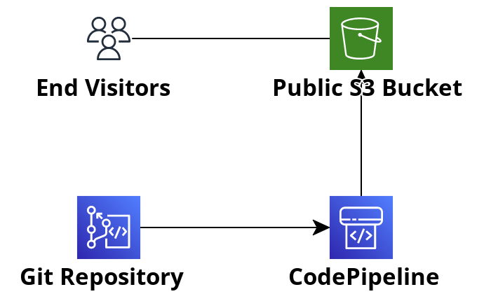

### Static HTML S3 Hosted Website

Included here is a simple CICD pipeline for an S3 hosted static website. 

The project will use Amazon CDK to create the following for your website:

* Git code repository to store the website source code using the [AWS CodeCommit service](https://aws.amazon.com/codecommit/).

* An S3 bucket that is open to the public to host the website files.

* A simple CodePipeline that will run when changes are merged to the main / master branch of the CodeCommit repo. Deploying changes to the bucket with a manual approval step.

### Architecture:

### Getting Started

First up install the dependencies required for the CICD pipeline:

_npm install_

Replace the html code in the codebase folder with your own.

_cp -r /tmp/my_files ./codebase_

Deploy the CDK stack with the command:

_npx cdk deploy_

After some time this will finish up, and you can log in to the AWS console to confirm resource creation.

